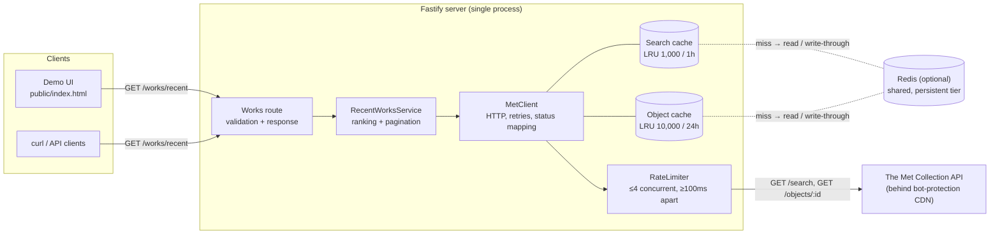
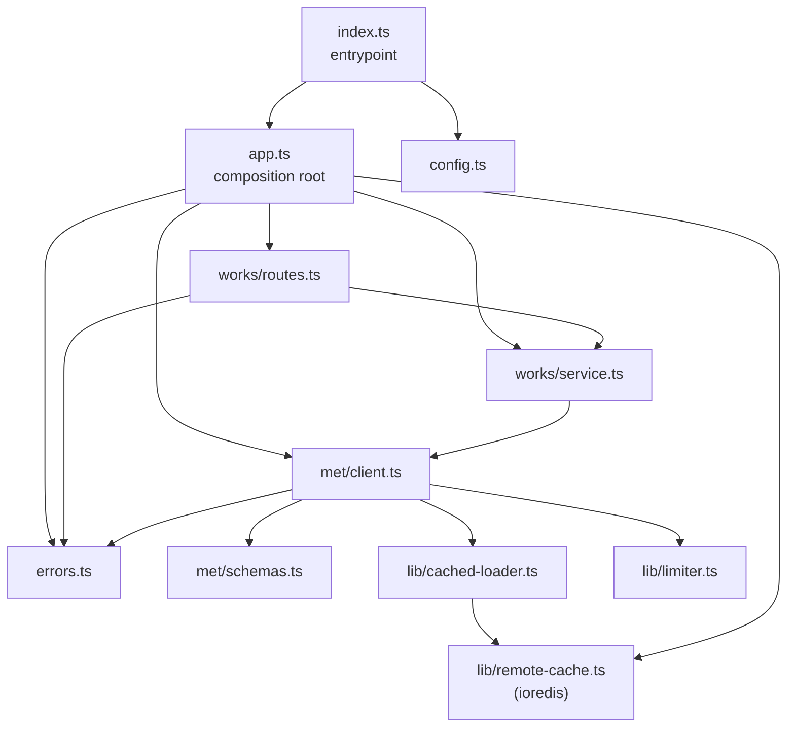
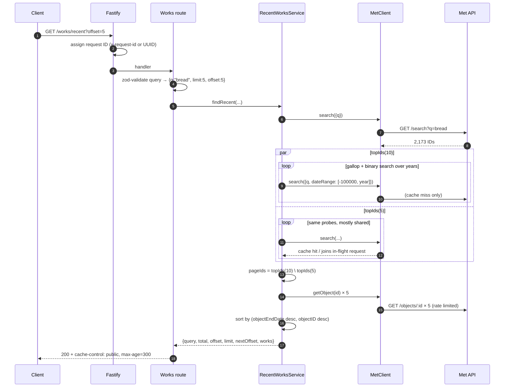
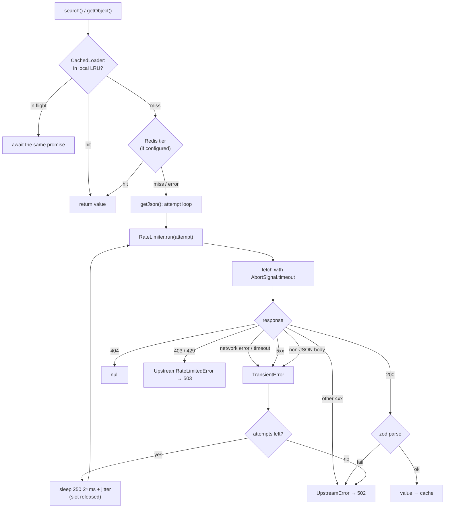
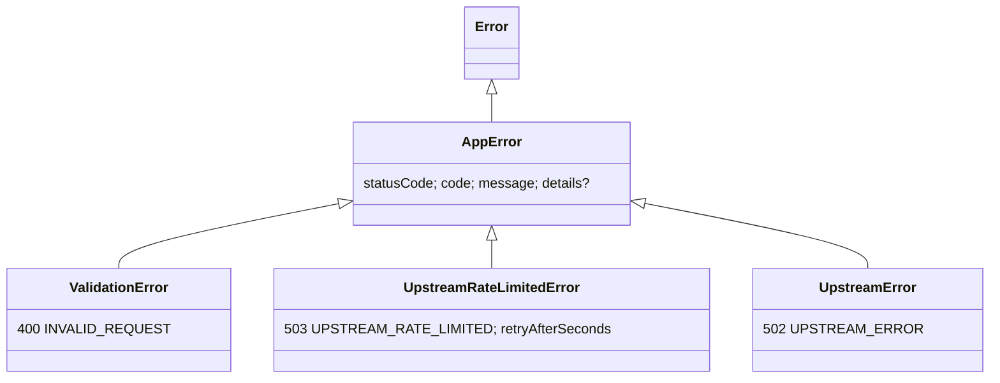

# Architecture

This document describes how the Met Recent Works service is put together: the constraints that shaped it, each
component's responsibilities and internals, how a request flows through the system, and where the design would go
next. For API usage and setup, see the [README](../README.md).

- [1. Problem and constraints](#1-problem-and-constraints)
- [2. System overview](#2-system-overview)
- [3. Request lifecycle](#3-request-lifecycle)
- [4. Components](#4-components)
  - [4.1 Entrypoint](#41-entrypoint--srcindexts)
  - [4.2 Configuration](#42-configuration--srcconfigts)
  - [4.3 App composition and HTTP concerns](#43-app-composition-and-http-concerns--srcappts)
  - [4.4 Works route](#44-works-route--srcworksroutests)
  - [4.5 RecentWorksService](#45-recentworksservice--srcworksservicets)
  - [4.6 MetClient](#46-metclient--srcmetclientts)
  - [4.7 RateLimiter](#47-ratelimiter--srcliblimiterts)
  - [4.8 CachedLoader and the Redis tier](#48-cachedloader-and-the-redis-tier--srclibcached-loaderts-srclibremote-cachets)
  - [4.9 Upstream schemas](#49-upstream-schemas--srcmetschemasts)
  - [4.10 Error model](#410-error-model--srcerrorsts)
  - [4.11 Demo UI](#411-demo-ui--publicindexhtml)
- [5. Cross-cutting concerns](#5-cross-cutting-concerns)
- [6. Testing strategy](#6-testing-strategy)
- [7. Failure modes](#7-failure-modes)
- [8. Limitations and evolution](#8-limitations-and-evolution)

---

## 1. Problem and constraints

**Goal:** given a search term (default `bread`), return the works from The Met's collection with the latest
`objectEndDate`, a page at a time, without restarting between queries.

The Met Collection API makes that harder than it sounds:

| Constraint | Consequence |
| --- | --- |
| `GET /search` returns **only object IDs**, in no meaningful order (2,173 for "bread"). | We can't sort from search results. |
| Dates are only on `GET /objects/{id}`, **one request per object**. | A naive sort costs one request per match. |
| The API sits behind a bot-protection CDN that **returns 403 to bursty clients**. It tripped at about 70 requests in a few seconds, and eventually even at about 3 req/s sequential. The block lasts minutes. | The naive approach isn't just slow, it gets the server IP-banned. Upstream calls are the scarcest resource. |
| `search` supports `dateBegin`/`dateEnd`, which were verified live to have **containment** semantics (below). | This is the lever the whole design rests on. |

```
search(q, dateBegin=B, dateEnd=E) = { o : o.objectBeginDate >= B  AND  o.objectEndDate <= E }
```

The overriding design principle follows: **minimize upstream requests, and in particular object fetches**. Search
calls cost one request each regardless of how many IDs they return. Object fetches cost one request per work.

## 2. System overview



### Module layout and dependencies



Dependencies point one way: HTTP → domain → upstream client → generic utilities. `lib/` knows nothing about the
Met. `met/` knows nothing about ranking or HTTP routes. `works/` knows nothing about fetch, retries or caching.
`app.ts` is the only place that wires concrete instances together, which is what makes the whole server testable
with an injected `fetch`.

## 3. Request lifecycle

A cold request for page 2 of "bread" (`GET /works/recent?offset=5`):



Measured against the live API: page 1 of "bread" costs 11 searches and 5 object fetches (about 3s cold). Page 2
then costs about 4 new searches and 5 fetches (about 1.4s). Any repeat is served entirely from cache (about 15ms).

---

## 4. Components

### 4.1 Entrypoint — `src/index.ts`

The process shell, kept deliberately thin so everything else can be tested in-process.

- Loads and validates configuration. An invalid environment fails fast at startup, not on first request.
- Builds the app with a real logger. The `pino-pretty` formatter is used only when `NODE_ENV !== 'production'` and
  stdout is a terminal. It's a devDependency, so production never tries to load it. `pnpm start` sets
  `NODE_ENV=production`.
- Handles `SIGINT`/`SIGTERM` by calling `app.close()`. That stops accepting connections and lets in-flight requests
  finish, then exits `0`. A failure during shutdown exits `1`.
- A failure to bind the port is logged as `fatal` and exits `1`.

### 4.2 Configuration — `src/config.ts`

All tunables come from environment variables, parsed by one zod schema. Each has a default, so the service runs
with no configuration at all.

| Variable | Default | Why this default |
| --- | --- | --- |
| `PORT` / `HOST` | `3000` / `0.0.0.0` | Container-friendly. |
| `LOG_LEVEL` | `info` | `debug` logs every upstream call with status and latency. |
| `MET_BASE_URL` | Met v1 | Overridable for a stub or proxy. |
| `MET_TIMEOUT_MS` | `8000` | Per *attempt*, not per request (see §8). |
| `MET_MAX_RETRIES` | `2` | Three attempts in total for transient failures. |
| `MET_MAX_CONCURRENCY` | `4` | Stays well under the CDN's burst threshold. |
| `MET_MIN_REQUEST_INTERVAL_MS` | `100` | At most 10 request starts per second. |
| `REDIS_URL` | unset | Unset means in-memory caching only. Set it to add the persistent, shared Redis tier (§4.8). An empty string counts as unset. |
| `REDIS_KEY_PREFIX` | `met-recent-works:v1:` | Namespaces keys in a shared Redis. Bump the version when cached value shapes change. |
| `SEARCH_CACHE_TTL_MS` | 1h | Search results change when the catalogue changes, which is rare. |
| `OBJECT_CACHE_TTL_MS` | 24h | Object records are close to immutable. |

`loadConfig(env)` takes the environment as an argument, so tests build configs from literal objects instead of
mutating `process.env`.

### 4.3 App composition and HTTP concerns — `src/app.ts`

`buildApp({ config, logger, fetch })` is the composition root. It returns a ready Fastify instance without
listening, so tests drive it with `app.inject()` and no network.

**Wiring.** It builds one `MetClient` (and with it the process-wide caches and rate limiter), one
`RecentWorksService`, and registers the routes. If `REDIS_URL` is set it also creates a `RedisCache`, hands it to
the client as the second cache tier, and closes it in an `onClose` hook. Tests inject a `remoteCache` instead, and
the app never closes an injected one, since it belongs to the caller. Because there is exactly one client per app, every request
shares the same cache and the same upstream budget, which is the point.

**Request IDs.** Fastify is configured with `requestIdHeader: 'x-request-id'` and `genReqId: randomUUID`. A caller's
ID is propagated, or a new one is minted. An `onSend` hook echoes it on every response, and it's included in
every error body and log line, so one ID ties a user report to the server logs.

**Routes it owns directly.**

- `GET /healthz` returns `{status: "ok"}`. It's a liveness check and deliberately doesn't call the Met: an upstream
  outage shouldn't make an orchestrator restart healthy instances.
- `GET /` serves `public/index.html`. The path is resolved relative to the module (`new URL('../public/…',
  import.meta.url)`), which gives the same result from `src/` under `tsx` and from `dist/` after the build.

**Error handling.** A single `setErrorHandler` turns every failure into one response shape:

```json
{ "error": { "code": "…", "message": "…", "requestId": "…", "details": { } } }
```

1. `AppError` subclasses map to their own status and code. 5xx-class errors log at `warn`, 4xx at `info`.
   `UpstreamRateLimitedError` also sets `Retry-After`.
2. Fastify's own client errors (anything with a 4xx `statusCode`, for example a malformed request) become
   `BAD_REQUEST` with that status.
3. Everything else is a bug. It's logged at `error` with the stack, and the client gets a generic 500 with no
   internals leaked.

`setNotFoundHandler` uses the same shape for unknown routes.

### 4.4 Works route — `src/works/routes.ts`

`GET /works/recent` is the HTTP adapter for the service. It owns input validation and HTTP semantics, nothing else.

| Param | Rule | Default |
| --- | --- | --- |
| `q` | string, trimmed, 1–200 chars | `bread` |
| `limit` | integer 1–20 (`MAX_LIMIT`) | `5` |
| `offset` | integer 0–10,000 (`MAX_OFFSET`, owned by the service) | `0` |
| `hasImages` | literal `true` or `false` | omitted |

Validation uses `safeParse`. On failure it throws `ValidationError` carrying zod's per-field messages, so clients
see *which* field failed:

```json
{ "error": { "code": "INVALID_REQUEST", "details": { "limit": ["Too big: expected number to be <=20"] }, … } }
```

`hasImages` accepts only the two literal strings, not zod's `coerce.boolean`, because `Boolean("false") === true`
would silently invert the filter.

Successful responses carry `cache-control: public, max-age=300`, so browsers or a CDN in front can absorb repeat
traffic without reaching the process at all.

### 4.5 RecentWorksService — `src/works/service.ts`

The core of the system: it decides *which* works belong on a page while fetching as few objects as possible.

#### Ordering

Works are ranked by **`objectEndDate` descending, then `objectID` descending**. That's a strict total order: every
pair of works compares unequal, so pages never overlap or skip. The ID tiebreak is arbitrary, but it's
deterministic and, crucially, it **can be evaluated without fetching the object**. Everything below relies on that
property.

#### The key identity

Using `MIN_YEAR = -100000` as a lower bound that includes everything:

```
newerThan(E) = search(q)  \  search(q, dateBegin=MIN_YEAR, dateEnd=E)
             = { o : o.objectEndDate > E }
```

That's an exact set computed from two search calls, and the first is shared by every probe. Because of
containment semantics, works whose range spans the boundary (for example 1850–1990 with E = 1983) are handled
correctly. They fail `endDate <= E`, so they correctly land in `newerThan(E)`.

`|newerThan(E)|` never increases as E increases, so we can binary-search on it.

#### `boundary(k)`: finding where rank k falls

It finds adjacent years `lo` and `hi = lo + 1` such that

```
|newerThan(hi)| < k  ≤  |newerThan(lo)|
```

and returns:

- `newer` = `newerThan(hi)`: works ending after `hi`. All have rank below k, and there are fewer than k of them.
- `ties` = `newerThan(lo) \ newerThan(hi)`: works ending *exactly* in year `hi`. Rank k falls inside this group.

The search has three phases:

1. **Anchor at the current year.** Recent years are where the answer usually is. If `newerThan(now)` already has
   k or more works (future-dated cataloguing quirks), it searches upward between now and `MAX_YEAR` instead.
2. **Gallop backwards** with steps of 4, 8, 16, 32 … years until a year with at least k newer works is found. This
   brackets the boundary in O(log d) probes, where d is how far back it is, not O(log 200,000) as a blind binary
   search over the whole year range would need.
3. **Binary search** inside the bracket down to adjacent years, another O(log d) probes.

A degenerate case: if the gallop reaches `MIN_YEAR` and there still aren't k works, the remaining matches have no
usable end date. They're treated as a single tie group ranked by ID, so the function always terminates with a
valid partition.

Worked example, "bread" with k = 5 (from the live server log):

```
gallop:  2026 <5 · 2022 <5 · 2014 <5 · 1998 <5 · 1966 ≥5         → bracket (1966, 1998]
binary:  1982 ≥5 · 1990 <5 · 1986 <5 · 1984 <5 · 1983 ≥5         → lo = 1983, hi = 1984
newer = { ends after 1984 }  → 4 works (1998, 1992, 1987, 1986)
ties  = { ends in 1984 }     → the highest objectID takes rank 5
```

#### `topIds(k)`: the exact set of the k most recent IDs

```
topIds(k) = newer ∪ (ties sorted by objectID desc).take(k − |newer|)
```

Because ties are broken by ID, the boundary year's group can be cut at exactly the right place with **no object
fetches**. Shortcuts: `k ≤ 0` gives ∅, and `k ≥ total` gives all IDs. Neither needs any probes.

#### `findRecent(query)`: assembling a page

```
page(offset, limit) = topIds(offset + limit) \ topIds(offset)
```

1. Fetch the unfiltered ID list (it gives `total` and is the universe for every set difference).
2. If `total ≤ DIRECT_FETCH_THRESHOLD` (20), fetch every object, sort, and slice. For small sets that's cheaper
   than probing.
3. If `offset ≥ total`, return an empty page.
4. Otherwise compute both `topIds` sets **concurrently**. Their probe sequences overlap heavily (the gallop starts
   from the same year), and `CachedLoader` coalesces identical in-flight searches, so running them in parallel
   costs about the same upstream calls as one and finishes sooner.
5. Fetch only the page's IDs, drop any that 404, sort by the ranking order, and map to the public `Work` shape.
6. `nextOffset = offset + limit` if more matches exist **and** that offset is one the route will accept (at most
   `MAX_OFFSET`), else `null`.

**404 policy: drop, don't backfill.** Search sometimes lists IDs the object endpoint no longer serves. Backfilling
from the next rank would make pages depend on which objects happened to 404, shifting every later page and
causing duplicates or gaps while paginating. Dropping keeps ranks stable, at the cost of an occasionally short
page. That's why `nextOffset`, not page length, signals the end.

**Mapping.** `toWork` turns empty upstream strings into `null` (clients shouldn't have to know `""` means
"unknown") and falls back to a canonical Met URL when `objectURL` is empty. Only the fields in `Work` are
exposed, so upstream additions never leak into our contract.

#### Cost model

| Step | Upstream requests |
| --- | --- |
| Universe search | 1 |
| Boundary probes, per new `k` | about 2 log₂(d), d = years from today to the boundary |
| Object fetches | `limit` (fewer for a short final page) |

Page 1 of "bread": 1 + 10 + 5 = 16 requests, against about 2,175 for fetch-everything. Deep pages cost about the
same as shallow ones, because the page's own objects are the only fetches.

### 4.6 MetClient — `src/met/client.ts`

The only component that talks to the network. Its job is to make an unreliable, rate-sensitive upstream look like
a well-behaved async function.

**Public surface:**

- `search(params) → number[]`: deduplicated IDs (the Met occasionally repeats IDs) in upstream order. It returns
  `[]` when the Met returns `objectIDs: null`.
- `getObject(id) → MetObject | null`: `null` means 404.

**Request pipeline, per logical call:**



Design points:

- **Retry only what's transient.** Timeouts, network errors, 5xx and truncated bodies are retried. 403/429 are
  **not**: this CDN extends blocks for clients that keep knocking, so the right move is to stop and tell our caller
  to back off (`503` + `Retry-After`, from the upstream header or 30s by default).
- **Backoff happens outside the limiter.** The sleep between attempts doesn't hold a concurrency slot, so one
  struggling request doesn't starve others.
- **Bodies are always consumed or cancelled** (`res.body?.cancel()`) on non-JSON paths, so undici can reuse
  connections instead of leaking sockets.
- **Cache keys are canonical.** `buildSearchQuery` builds the query string in a fixed order, with `q` last as the
  Met docs show. The same logical search always hits the same cache entry.
- **404 is a value, not an error.** It's cached as `{ object: null }` so repeat lookups of a missing object cost
  nothing. The `{ object }` / `{ ids }` wrappers exist because the LRU can't store `null` or `undefined` directly.
- **Parse failures are upstream errors.** If the Met changes shape, clients get a clean 502, not a 500 or a
  half-populated response.

### 4.7 RateLimiter — `src/lib/limiter.ts`

It keeps outbound traffic under the CDN's burst detection by combining two limits:

- **Concurrency:** at most `maxConcurrency` tasks run at once. Extra tasks wait in a FIFO queue.
- **Pacing:** consecutive task *starts* are at least `minIntervalMs` apart, which caps burst rate independently of
  latency.

Two details matter for correctness:

1. **Direct slot handoff.** On release, if a waiter exists, the slot passes straight to it and `active` doesn't
   change. The naive version (decrement, then wake the waiter, which increments) has a race: a newly arriving task
   can see the decremented count and take the slot before the woken waiter runs, briefly exceeding the limit.
2. **Start slots are reserved synchronously.** Each acquirer computes its start time from `nextStartAt` and bumps
   it *before* sleeping. N tasks arriving together are spaced `0, Δ, 2Δ, …` instead of all waking at once after
   `Δ`.

`run()` releases in `finally`, so a throwing task never leaks a slot (there's a test for this).

### 4.8 CachedLoader and the Redis tier — `src/lib/cached-loader.ts`, `src/lib/remote-cache.ts`

A read-through cache that wraps a loader function, with an optional shared second tier:

```
get(key):  local LRU  →  in-flight map  →  Redis (optional)  →  loader (the Met)
                                                        writes go to both tiers ↩
```

- **LRU + TTL** via `lru-cache`, bounded by entry count (searches 1,000, objects 10,000). This is the first tier:
  warm hits never leave the process (about 15ms end to end), with or without Redis.
- **In-flight coalescing:** a `Map<key, Promise>` makes concurrent `get(key)` calls share one load. This matters
  twice. Concurrent HTTP requests for the same query make one set of upstream calls. And within a single request,
  the two `topIds` computations share their overlapping probes.
- **Failures aren't cached.** A rejected load is removed from the in-flight map (`finally`) and never written to
  the LRU, so the next call retries. Combined with MetClient's error mapping, a brief upstream incident doesn't get
  frozen into the cache for an hour.

It's generic over key and value, with no Met or HTTP knowledge, and is unit-tested on its own.

#### The Redis tier

`RemoteCache` is a three-method interface (`get`, `set(key, value, ttlMs)`, `close`). `RedisCache` implements it with
ioredis, storing JSON under `REDIS_KEY_PREFIX + namespace + ":" + key`. Examples:
`met-recent-works:v1:search:q=bread` and `met-recent-works:v1:object:436535`.

What it adds:

- **Survives restarts and deploys.** A new process starts with empty LRUs but a warm Redis. A test proves a
  restarted instance serves a page with **zero** upstream calls. This matters beyond latency: a deploy no longer
  triggers a burst of Met traffic, which is exactly what the bot protection punishes.
- **Shared across replicas.** N instances share one cache, so each object is fetched from the Met once per TTL,
  not N times.

Design rules:

- **Best effort, never required.** Any Redis error on read is treated as a miss. Writes are fire-and-forget, with
  failures logged at `debug`. A request never fails, and never waits on a write, because of the cache.
- **Fail fast, don't queue.** The client runs with `enableOfflineQueue: false`, `maxRetriesPerRequest: 0`, a 1s
  connect timeout and a 500ms command timeout. When Redis is down, commands reject immediately, so requests fall
  through to the Met at normal speed instead of hanging. Reconnects continue in the background with backoff (up to
  5s).
- **Quiet but visible.** Connectivity changes are logged once each: one `warn` when Redis becomes unavailable
  (including a bad `REDIS_URL` at startup), and one `info` when it connects. Reconnect attempts in between aren't
  logged.
- **Local de-duplication stays local.** Concurrent identical loads are coalesced in process before reaching Redis.
  Two replicas can still both miss and both call the Met for the same key. That's harmless (same value, and the
  last write wins) and rare enough not to justify a distributed lock.
- **Versioned keys, trusted values.** Only this code writes under the prefix, so values read back are trusted to
  have the expected shape rather than re-validated. The version in the prefix is the migration mechanism: bump it
  when a value shape changes, and old keys simply expire.
- **TTL.** Redis entries get the same TTL as the corresponding LRU (`PX`). A value read from Redis starts a fresh
  local TTL, so in the worst case a value can be served for up to about twice the TTL after it was first fetched.
  That's fine for catalogue data; if it mattered, `PTTL` could carry the remaining lifetime across.

### 4.9 Upstream schemas — `src/met/schemas.ts`

zod schemas for the two upstream responses, with a deliberate **tolerant-reader** stance:

- Only fields we use are declared. Unknown fields are ignored, so upstream additions are harmless.
- `objectIDs` is `nullable()` because the Met returns `null` rather than `[]` for no matches.
- String fields `default('')`, because Met records are inconsistently populated.
- `objectBeginDate`/`objectEndDate` are required integers. Ranking is meaningless without them, so their absence
  is a real contract break and should surface as a 502.

The inferred `MetObject` type is the single source of truth for the upstream shape across the codebase.

### 4.10 Error model — `src/errors.ts`



- Errors carry their own HTTP status and a **stable machine-readable `code`**. Clients branch on `code`; `message`
  is for humans and may change.
- Upstream problems are split by what the client should do: **503** means "we're being throttled, retry after N
  seconds". **502** means "the upstream is broken or returned garbage".
- The original failure is kept as `cause` for logs but never serialized to clients.
- `TransientError` is private to `MetClient`. It's a retry signal, not an API-level error, and it's always turned
  into an `UpstreamError` before leaving the client.

### 4.11 Demo UI — `public/index.html`

A single static file with inline CSS and plain JavaScript: no framework, no build step, served by the API on the
same origin, so no CORS is needed.

- **State model:** `{ q, limit, offset, hasImages }` is the only state, mirrored to the URL query string.
  Search and page changes `pushState`; back/forward (`popstate`) restores the form and reloads. Every page is
  linkable.
- **Fetching:** searches happen on submit only, never per keystroke, to protect the shared upstream budget. Each
  new request aborts the previous one with an `AbortController`, and stale responses are ignored, so a slow cold
  query can't overwrite a newer result.
- **Rendering:** all API data is inserted via `textContent` or `createElement`, never `innerHTML`, so catalogue
  text can't inject markup. Cards show the main fields, a lazy-loaded thumbnail (small image, then full image,
  then a "No public image" placeholder, since the API only serves public-domain images), and a collapsible raw
  JSON view.
- **Pagination:** Next follows `nextOffset` (so short pages after a dropped 404 don't end paging). Previous steps
  back by `limit`. The page count stops at the last offset the API accepts.
- **States:** loading (skeletons plus "Querying the Met…"), empty, and structured errors showing `code`,
  `message`, `requestId`, and a retry hint for 503.
- The status line shows client-measured latency, which makes the cache visible in a demo: about 3–5s cold versus
  about 20ms warm.

---

## 5. Cross-cutting concerns

### Caching layers

| Layer | Key | Lifetime | Purpose |
| --- | --- | --- | --- |
| Search cache | canonical query string (incl. date range, `hasImages`) | 1h, 1,000 entries | Makes probes and repeat queries free. Shared across queries and pages. |
| Object cache | object ID | 24h, 10,000 entries | Objects appear across queries and pages. Also caches 404s. |
| Redis (optional) | `REDIS_KEY_PREFIX` + `search:`/`object:` + key | same TTLs, `PX` | Survives restarts; shared by replicas. Best effort. |
| In-flight map | same as the cache | request duration | Coalesces concurrent identical loads (per process). |
| HTTP `cache-control` | URL | 5 min | Lets browsers or CDNs skip the server for repeats. |

The service itself holds no state. Every "memory" in the system is in these caches, so correctness never depends on
cache contents, only latency does.

### Concurrency

- Node's single event loop means no locks are needed around cache or limiter state. Each mutation happens
  synchronously between awaits.
- There's one global upstream budget per process, the `RateLimiter`, shared by all requests. Under load, requests
  queue in the limiter rather than multiplying pressure on the Met.
- Within a request, independent upstream work runs concurrently (the two `topIds` calls, the page's object
  fetches). Inherently sequential work (each binary-search probe depends on the last) stays sequential.

### Observability

- Structured JSON logs (pino) with the request ID bound to every line of a request.
- At `LOG_LEVEL=debug`, every upstream call is logged with URL, status and latency. That's the fastest way to see
  the cost model in action.
- Retries log at `warn` with attempt number and delay. Upstream failures log at `warn`; bugs at `error`.

### Security

- All input is validated and bounded (`q` ≤ 200 chars, `limit` ≤ 20, `offset` ≤ 10,000). That caps both the upstream
  work one request can trigger and the size of the cache keys.
- The upstream URL is fixed by config; user input only ever becomes URL-encoded query parameter values.
- Error responses never include stack traces or upstream bodies.
- The UI never interprets API data as HTML.

---

## 6. Testing strategy

Tests run the **real application** (`buildApp` plus `app.inject`) against **`FakeMet`**, an in-memory stand-in
injected through the `fetch` option. There are no mocks of internal modules, so the tests cover routing,
validation, the service, the client, the caches and the limiter together.

`FakeMet` (`test/fake-met.ts`) reproduces the upstream behaviours the design depends on:

- ID-only search, and `objectIDs: null` on no match
- containment semantics for `dateBegin`/`dateEnd`, as verified against the live API
- switchable failure modes: persistent status (`failWith`) and N transient 500s (`transientFailures`)
- a call log, so tests can assert **how many** upstream requests were made, not just what was returned

Key test families (`test/works.test.ts`, `test/lib.test.ts`):

| Family | What it proves |
| --- | --- |
| Randomized correctness | For many seeded datasets and several limits, results equal a brute-force sort of every object. |
| Full pagination walks | Following `nextOffset` through spread-out and tie-heavy datasets reproduces the full ordering exactly: no duplicates, no gaps. |
| Cost assertions | Page 1 fetches at most `limit` objects. Page 5 fetches exactly 10. Repeats make zero upstream calls. Concurrent identical requests cost the same as one. |
| Edge cases | Wide date ranges that span the boundary, boundary ties, 404 drops, empty results, small direct-fetch sets, offsets past the end, the `MAX_OFFSET` cap. |
| Failure mapping | 403 → 503 with no retry. Transient 5xx is retried and recovers. Exhausted retries → 502 and aren't cached. Bad upstream shape → 502. |
| Validation | Every invalid parameter gives a structured 400 naming the field, with no upstream calls. |
| Redis tier (`test/cache.test.ts`) | Remote hits skip the loader, loads write through, Redis being down falls back transparently, `RedisCache` round-trips JSON with prefix and TTL (against `ioredis-mock`), and a restarted app sharing the cache makes zero upstream calls. |
| Primitives | The limiter never exceeds concurrency, spaces starts, and releases on throw. The loader coalesces and doesn't cache failures. |

The one assumption the fake can't verify is that the **live** Met still uses containment semantics. See §8.

---

## 7. Failure modes

| Situation | Behaviour | Client sees |
| --- | --- | --- |
| Met throttles or blocks (403/429) | No retry. The request fails fast. | `503 UPSTREAM_RATE_LIMITED` + `Retry-After` |
| Met 5xx, timeout or connection reset | Up to 2 retries with backoff | Success, or `502 UPSTREAM_ERROR` |
| Met returns an unexpected JSON shape | No retry (it's deterministic) | `502 UPSTREAM_ERROR` |
| Search lists an ID that 404s | Dropped from the page, 404 cached | Short page, stable `nextOffset` |
| Invalid query parameters | Rejected before any upstream call | `400 INVALID_REQUEST` + per-field details |
| Offset beyond the matches | No probes or fetches | `200` with empty `works`, `nextOffset: null` |
| Unexpected exception | Logged with stack | `500 INTERNAL_ERROR` (no internals) |
| Process restart without Redis | Local caches are lost. The next requests are cold. | Higher latency, never wrong results |
| Process restart with Redis | Local caches refill from Redis | Warm latency from the first request |
| Redis down or unreachable | One `warn` log. Reads miss and writes are skipped, failing fast. Background reconnect. | Same results, cold-ish latency |

---

## 8. Limitations and evolution

**The date-filter semantics are an undocumented dependency.** Correctness rests on the containment behaviour
verified against the live API. Mitigations: the final ordering always comes from fetched objects, and a scheduled
canary could compare the narrowing result with a slow brute-force sort for a small query and alert on drift.

**No end-to-end request deadline.** The timeout is per attempt (8s × up to 3 attempts, plus backoff), and boundary
probes are sequential. A degraded upstream can make one request take a long time. Next step: an overall deadline
(`AbortSignal.any` of the request's signal and a budget), and cancelling upstream work when the client disconnects.

**Cold latency** is dominated by about 10 sequential probes. Options:

- k-ary search: probe 3 years concurrently per round, which cuts rounds by about 2× at a small extra cost.
- Better starting guesses: the previous boundary for the same `q`, or a coarse per-query histogram.
- Pre-warm popular terms (like `bread`) at startup.

**Memory.** The search cache stores full ID arrays for every probe. For "bread" that's small (about 2k IDs per
entry). For very broad terms each entry could be 100k+ IDs, and 1,000 entries of that is significant. Options: size
the LRU by bytes (`maxSize` + `sizeCalculation`) instead of count, or use v1.1 counts (below).

**Search v1.1** (`/v1.1/search`) returns filtered `total` counts cheaply (`limit=1`, about 36 bytes). Boundary
probes only need counts, so they'd become constant-size, which fixes the memory and bandwidth issue for broad
terms. Caveats that stopped us adopting it directly:

- It matches a different set of objects (only "publicly available": 2,053 vs 2,173 for "bread"), so it can't be
  mixed with v1 in set arithmetic.
- `offset + limit ≤ 10,000`.
- Its pages come from an unordered ID list, not date order.

A full v1.1 migration would fetch the final IDs with `search(dateBegin = hi, dateEnd = MAX_YEAR)` when no works
straddle the boundary, falling back to paged set differences when they do.

**Multi-instance deployment.** With `REDIS_URL` set the caches are shared, but the **rate limiter is still per
process**, and the CDN's ban applies per egress IP. Behind a shared NAT, N replicas get N× the upstream rate and
share one ban. Next steps:

- A distributed token bucket in the same Redis for the upstream budget.
- A circuit breaker that, after a 403, stops all upstream calls for the `Retry-After` window and serves stale cache
  entries where possible (stale-while-revalidate).

**"Has images" is not "has a displayable image".** The Met's `hasImages` search flag means "pictured on
metmuseum.org", but the API only returns image URLs for public-domain works (`isPublicDomain`). Ranking by recency
favours in-copyright works, so the top results rarely have an image even with the filter on. There's no search
parameter for public domain, so a true "public image only" filter can't use the set-difference trick. It would
have to fetch objects in rank order and filter them, which costs object fetches in proportion to how sparse images
are. It would need a per-request fetch budget and a way to report partial results.

**Cursor pagination.** `offset` is stable only while the upstream data is. An opaque cursor encoding
`(objectEndDate, objectID)` of the last item would stay correct across catalogue updates, and the tie rule already
defines exactly where to resume.
